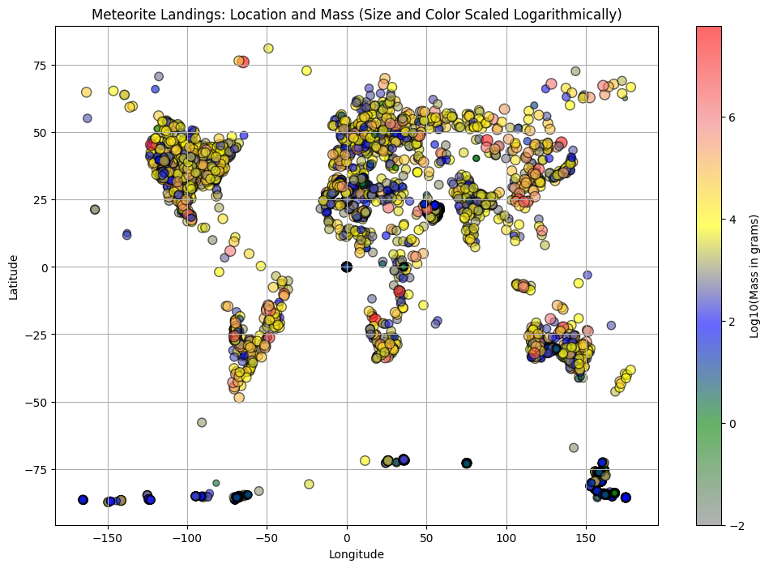

# Your turn: Data science

In this *your turn*, we will be using [NASA's Meteorite Landings data set](https://data.nasa.gov/Space-Science/Meteorite-Landings/gh4g-9sfh/about_data) to understand and visualize when and where meteors have landed aroudn the world.

## Version warning

This chapter requires PyCharm Professional to complete as indicated. Please see the [version breakdown](https://www.jetbrains.com/pycharm/editions/) at JetBrains.

## Objectives

1. Create a Jupyter Notebook in PyCharm
2. Load some public data sources.
3. Draw pretty graphs with that data

## Create a Jupyter Notebook in PyCharm

We are going to create a Jupyter Notebook inside PyCharm to work with this data. Create a folder with a virtual environment and copy the `meteorite-landings.csv` file into that folder. Then open the folder as a project in PyCharm.

`Choose File > New > Jupyter Notebook`

And give it a name.

You'll need a few libraries for this project, so add these to the first cell.

```python
import pandas as pd
import matplotlib.pyplot as plt
import numpy as np
from matplotlib.colors import LinearSegmentedColormap
```

You will also need to install these libraries along with jupyter itself. Open the terminal and run this command (with the virtual environtment active):

```bash
pip install pandas matplotlib jupyter
```

If you are using uv, you will need to use the command `uv pip install ...` instead.

Now run the import cell to make sure everything is working correctly.

## Loading our data

Now we can load our data using pandas. Create a cell with the command:

```python
df = pd.read_csv('meteorite-landings.csv')
df
```

The first loads it, the second tells PyCharm to display the table / visualizer. Play around with the table and visualizer and get to know the data.

## Visualize the data

 Now we are ready to visualize the data. We'll create a geo plot with the color and size of the points. If you are skilled in data visualizations, feel free to play around with these. If not, go ahead and enter this as the next cell.

```python
# Assuming the data has the following columns:
# - 'mass (g)' for the mass of the meteorite in grams,
# - 'reclat' for the latitude, and
# - 'reclong' for the longitude.
# Adjust these column names if needed.

# Filter out rows with non-positive mass and missing lat/long values.
df = df[(df['mass (g)'] > 0) & df['reclat'].notnull() & df['reclong'].notnull()]

# Apply a logarithmic transformation to handle the wide range in mass.
# Using np.log10 because masses can span multiple orders of magnitude.
log_mass = np.log10(df['mass (g)'])

# Shift the log_mass values so that the smallest value becomes 1 (instead of 0 or negative).
adjusted_log_mass = log_mass - log_mass.min() + 1

# Scale the adjusted log mass for marker sizes.
scaled_sizes = adjusted_log_mass * 10  # Adjust this multiplier to change the size variation.

# Create a custom colormap with a spectrum:
# From gray (small mass) to green, blue, yellow, light red, and red (largest mass).
cmap = LinearSegmentedColormap.from_list("Spectrum",
                                         ["gray", "green", "blue", "yellow", "lightcoral", "red"])

# Create the scatter plot using longitude and latitude.
plt.figure(figsize=(12, 8))
sc = plt.scatter(df['reclong'], df['reclat'],
                 s=scaled_sizes,       # Marker size based on adjusted log mass
                 c=log_mass,           # Color based on the original log-transformed mass
                 cmap=cmap,
                 alpha=0.6,
                 edgecolor='k')

plt.xlabel('Longitude')
plt.ylabel('Latitude')
plt.title('Meteorite Landings: Location and Mass (Size and Color Scaled Logarithmically)')
plt.grid(True)
plt.colorbar(sc, label='Log10(Mass in grams)')
plt.show()
```

You should see this graph which maps the location and size to the place on the world map:



Pretty amazing, eh? Keep playing with the data and see what you can discover!


----------------

*See a mistake in these instructions? Please [submit a new issue](https://github.com/talkpython/mastering-pycharm-course/issues) or fix it and [submit a PR](https://github.com/talkpython/mastering-pycharm-course/pulls).*
